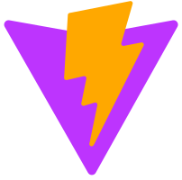

<!-- 欢迎部分 -->

   <h1>Hi there, I'm <a href="https://nuozhen.github.io" target="_blank">NuoZhen</a>  </h1>

<!-- 欢迎 -->

<h3>🎉Welcome to my GitHub profile page!🎉</h3>

<!-- 名、特征、位置 -->

<h3> 🧑‍💻 Nuo Zhen | 💻 Full Stack Developer | 🌏 China </h3>

<!-- 常用软件标签 -->

<!-- 静态徽章 -->

<!-- 访问统计 -->

<!-- 打字效果 -->

<!-- 自我介绍+GIF -->

<h3>I'm a self-taught full-stack developer from China.</h3>

- 🧑‍💻 I work in back-end development.
- 😋 I‘m interested in Java, front and back end development,
-    databases, computer networks, operating systems, AI, etc.
- 🎮 I'm also a gamer and enjoy RPG, ACT, AVG, FPS, MOBA, and other types of games.

<!-- 技术栈标签 -->
<h2 align="left">Skill Stack</h2>

<h3 align="left">Programming Languages</h3>

 

<h3 align="left">Frontend Development</h3>

<h3 align="left">Backend Development</h3>

<h3 align="left">Database</h3>

<h3 align="left">AI / ML</h3>

<h3 align="left">Infrastructure</h3>

 
 
 

<h3 align="left">Tools</h3>

 

<!-- Stats -->
<h2 align="left">Stats</h2>

<!--

-->

<!-- 贡献图 -->

<!-- 开源项目 -->

<!-- 底部 -->

